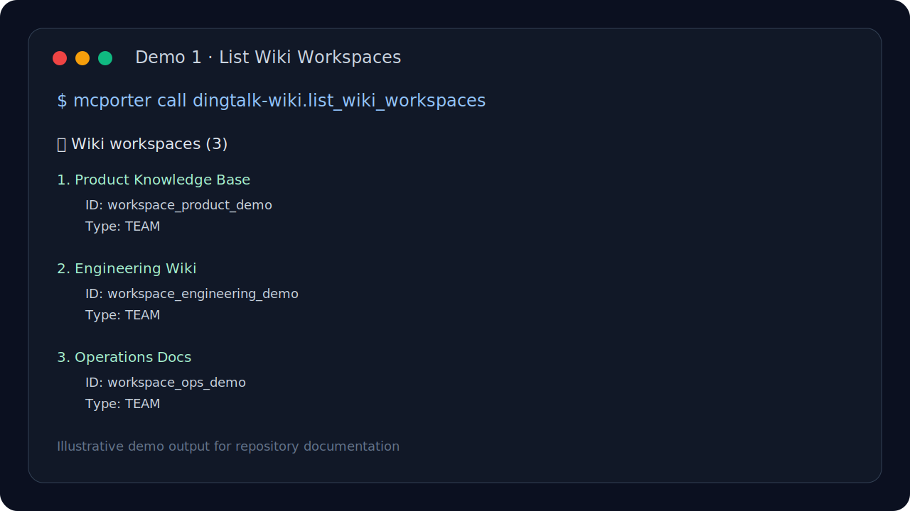
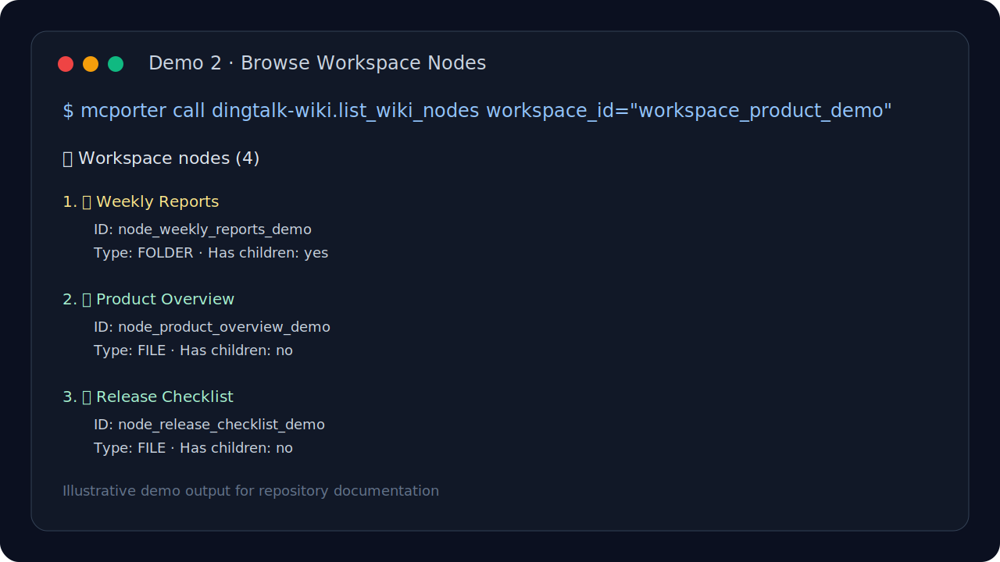
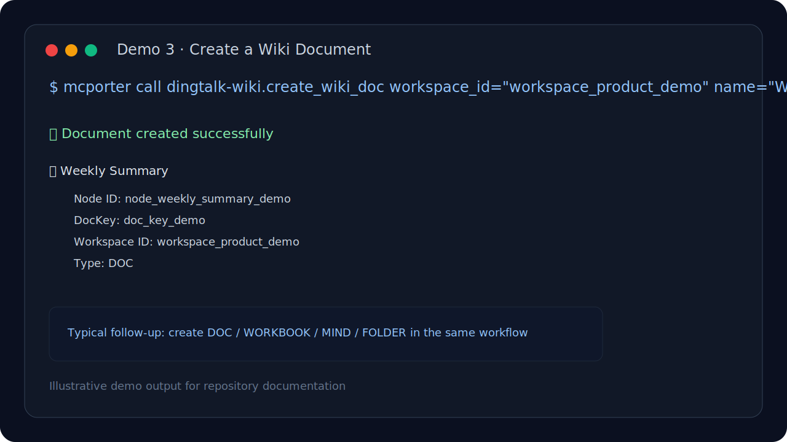

# dingtalk-wiki-mcp

[](https://github.com/ianen/dingtalk-wiki-mcp/releases)
[](./LICENSE)
[](https://github.com/ianen/dingtalk-wiki-mcp)
[](./package.json)

**DingTalk Wiki / Docs read-write MCP server that fills the gap left by DingTalk official MCP.**

[中文文档 / Chinese docs](./README.zh-CN.md)

> DingTalk's official MCP does **not** provide Wiki / Docs read-write capability.  
> This project is an open-source complement that makes AI agents and MCP clients actually able to **read, browse, and create DingTalk Wiki / Docs content**.

## Repository Highlights

- **Official MCP gap**: Wiki / Docs read-write is not covered
- **This project adds it**: workspace browsing, node browsing, and document creation
- **MCP-compatible**: works with stdio-based MCP clients
- **Agent-ready**: includes `SKILL.md` for OpenClaw-style skill workflows

---

## Quick Start

### 1) Install

```bash
npm install
```

### 2) Configure environment

```bash
cp .env.example .env
```

Required:

```env
DINGTALK_APP_KEY=your-app-key
DINGTALK_APP_SECRET=your-app-secret
```

### 3) Prepare local config

```bash
cp config.example.json config.json
```

### 4) Run

```bash
npm start
```

Or:

```bash
node index.js
```

> `npx dingtalk-wiki-mcp` is a future-friendly path after npm publishing.  
> This repository already includes the correct CLI entry (`bin`), but npm distribution is not part of the current release yet.

---

## DingTalk official MCP vs this project

| Capability | DingTalk official MCP | dingtalk-wiki-mcp |
|---|---:|---:|
| Wiki read | Not covered | ✅ |
| Wiki write | Not covered | ✅ |
| Create docs | Not covered | ✅ |
| Create folders | Not covered | ✅ |
| Create mind maps | Not covered | ✅ |
| Browse workspaces | Not covered | ✅ |
| Browse nodes / folders | Not covered | ✅ |
| MCP client compatibility | Partial / official scope only | ✅ stdio MCP-compatible |
| OpenClaw skill packaging | No | ✅ includes `SKILL.md` |

**Positioning principle:** this project does **not** replace the official DingTalk MCP. It **complements** it by filling the Wiki / Docs gap.

---

## Core capabilities

### Wiki / Docs
- List Wiki workspaces
- Get workspace details
- List Wiki nodes (folders / docs)
- Create:
  - `DOC`
  - `WORKBOOK`
  - `MIND`
  - `FOLDER`
- Search Wiki by linking to DingTalk search

### Organization
- List departments
- List department users
- Get user info

### Operator / Config
- Set current operator (`unionId`)
- Use a default operator from local config
- Inspect current local config

### Skill included
This repo is not only an MCP server. It also includes:

- `SKILL.md`

So it can be reused as a **skill package** in OpenClaw-style agent workflows.

---

## Demo

### 1. List Wiki workspaces



### 2. Browse workspace nodes



### 3. Create a document



> These demo images are illustrative documentation assets built from representative command/output flows, with all tenant-specific data removed.

---

## Real use cases

### 1) AI automatically creates weekly report docs
Your AI agent can create a fresh DingTalk Wiki document every week for sales, product, or ops reporting.

### 2) Agent explores Wiki structure before writing
Before generating content, an agent can inspect workspaces and folders first, then choose the right target node.

### 3) Auto-initialize project knowledge-base structure
When a new project starts, automation can create a standard folder tree such as:

- Project Overview
- Weekly Reports
- Specs
- Release Notes
- Retrospectives

---

## Client integration examples

- [OpenClaw example](./docs/clients/openclaw.md)
- [mcporter example](./docs/clients/mcporter.md)
- [Generic MCP client example](./docs/clients/generic-mcp-client.md)

---

## Example usage

### Show config

```bash
mcporter call dingtalk-wiki.show_config
```

### List workspaces

```bash
mcporter call dingtalk-wiki.list_wiki_workspaces
```

### List nodes

```bash
mcporter call dingtalk-wiki.list_wiki_nodes workspace_id="your_workspace_id"
```

### Create a document

```bash
mcporter call dingtalk-wiki.create_wiki_doc \
  workspace_id="your_workspace_id" \
  name="Weekly Summary" \
  doc_type="DOC"
```

### Get user info

```bash
mcporter call dingtalk-wiki.get_user_info userid="your_user_id"
```

---

## Available MCP tools

- `set_operator`
- `show_config`
- `list_wiki_workspaces`
- `get_wiki_workspace`
- `list_wiki_nodes`
- `get_wiki_node`
- `create_wiki_doc`
- `search_wiki`
- `list_departments`
- `get_department_users`
- `get_user_info`

---

## Requirements

- Node.js 18+
- A DingTalk app with the required API permissions
- A stdio-compatible MCP client, such as:
  - OpenClaw
  - mcporter
  - other MCP hosts / clients

---

## Permissions

Depending on what you use, your DingTalk app may need permissions such as:

- `Document.WorkspaceDocument.Write`
- Wiki read permissions
- Department read permissions
- User read permissions

Please refer to DingTalk Open Platform documentation for the latest permission names and approval requirements.

---

## Trust materials

- [FAQ](./FAQ.md)
- [Changelog](./CHANGELOG.md)
- [API test notes](./API_TEST_REPORT.md)
- [Skill definition](./SKILL.md)

---

## Security notes

- `config.json` contains your local user and workspace metadata, so **do not commit it**
- this repository already ignores `config.json` and `.env`
- inject AppKey / AppSecret via environment variables instead of hardcoding them

---

## Limitations

- This is a community-maintained complement, not an official DingTalk project
- Some APIs require enterprise approval on the DingTalk side
- `search_wiki` is currently more of a search-entry helper than a full-text search implementation

---

## Related links

- [DingTalk Open Platform - Knowledge Base Overview](https://open.dingtalk.com/document/development/knowledge-base-overview)
- [Create Team Space Document](https://open.dingtalk.com/document/development/create-team-space-document)

---

## License

MIT
